# CampusSync - System Architecture

## 📋 Overview

This document provides a comprehensive overview of the CampusSync architecture, including system diagrams, component relationships, and data flow patterns. CampusSync is a panel-based educational management platform with distinct interfaces for administrators, teachers, and students.

## 🏗️ High-Level Architecture

### System Components Diagram

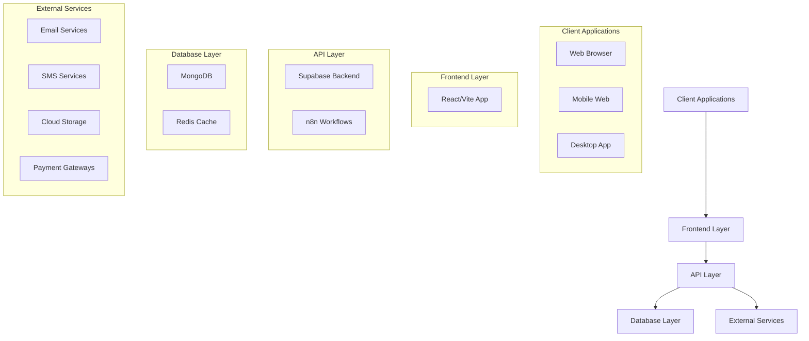

### Panel-Based System Architecture

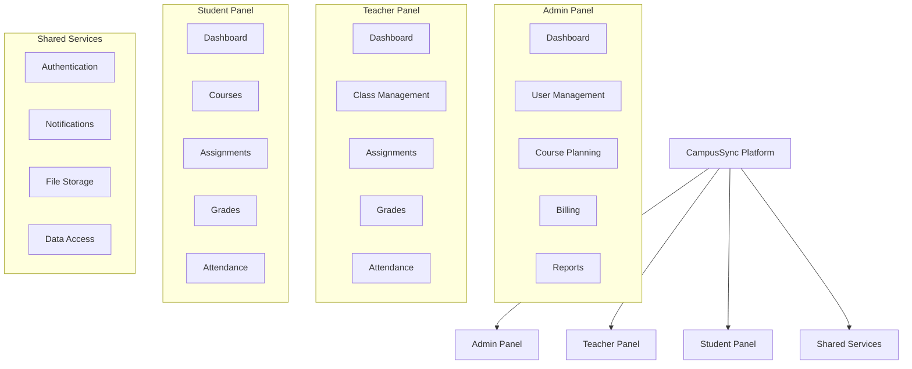

## 🎨 Frontend Architecture

### Component Hierarchy

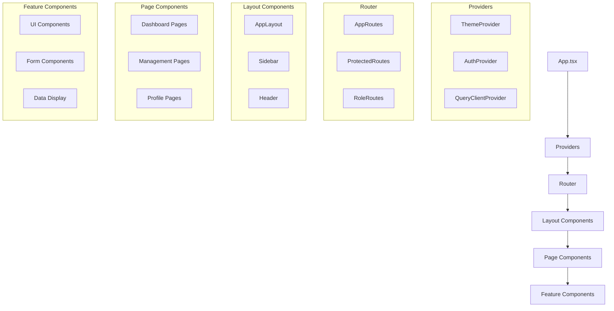

### State Management Flow

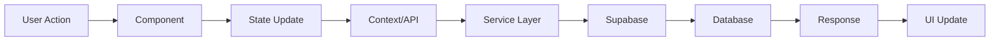

## ⚙️ Backend Architecture

### API Layer Structure

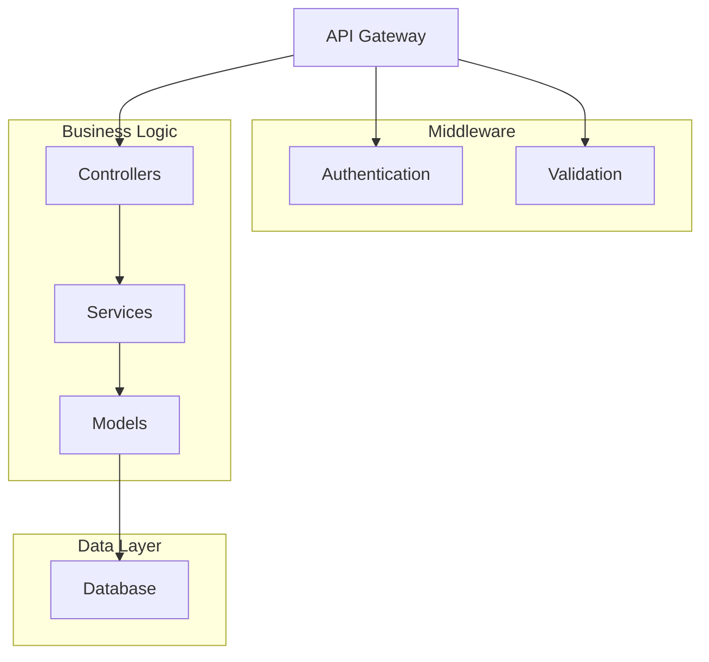

### Data Flow Pattern

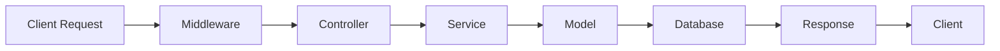

## 🗃️ Database Design Overview

### Core Entity Relationships

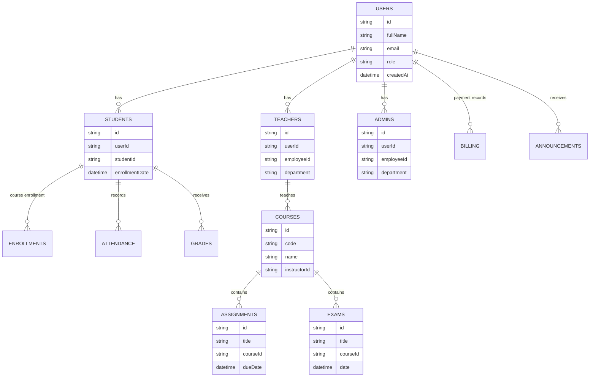

## 🔧 Workflow Automation (n8n)

### Automation Architecture

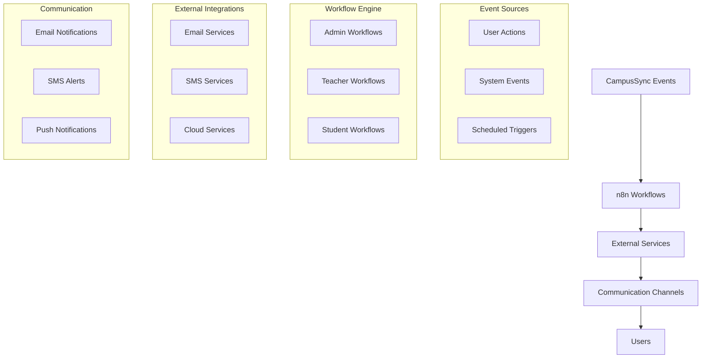

## 🔄 Data Flow Patterns

### Authentication Flow

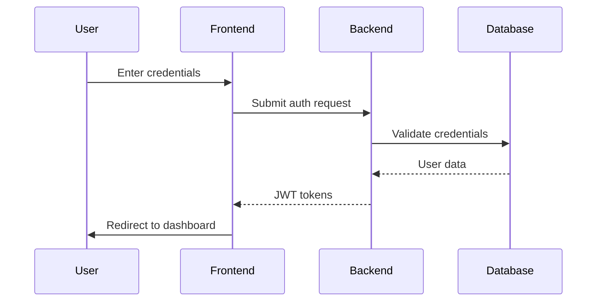

### Assignment Submission Flow

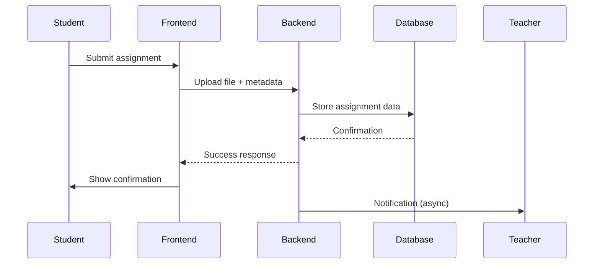

## 📐 Folder Structure Overview

### Project Organization

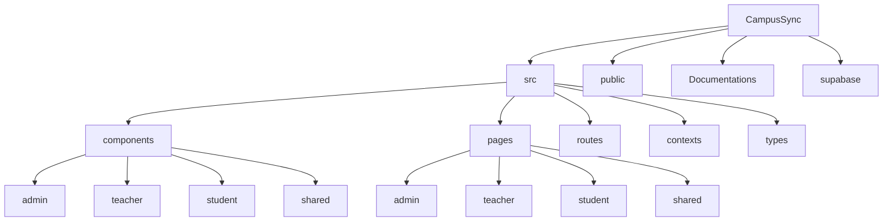

## 🌐 Deployment Architecture

### Cloud Infrastructure

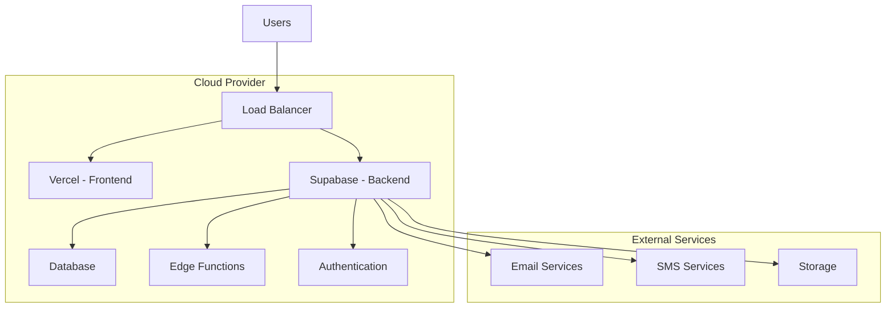

## 🔐 Security Architecture

### Authentication & Authorization

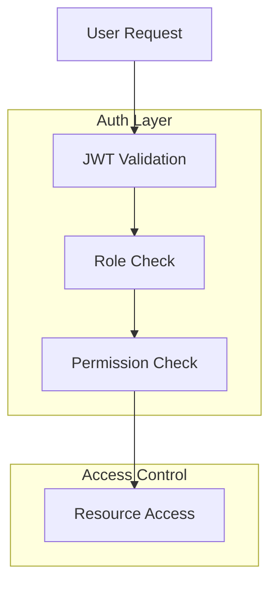

## 📊 Monitoring & Analytics

### System Monitoring Flow

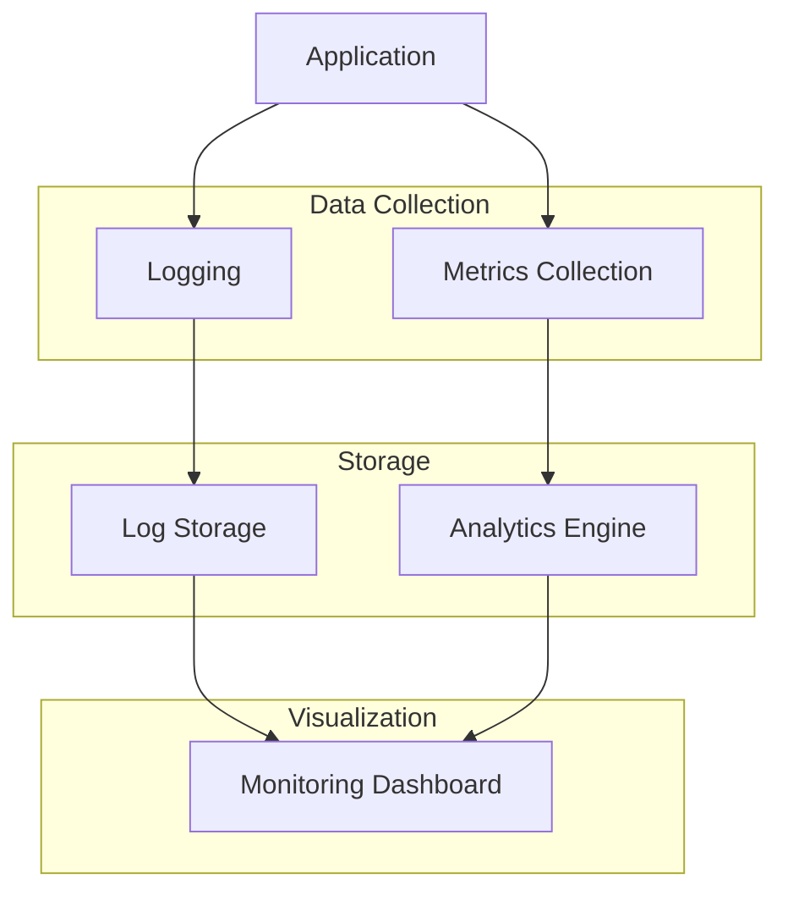

## 🚀 Future Architecture Enhancements

### Microservices Evolution

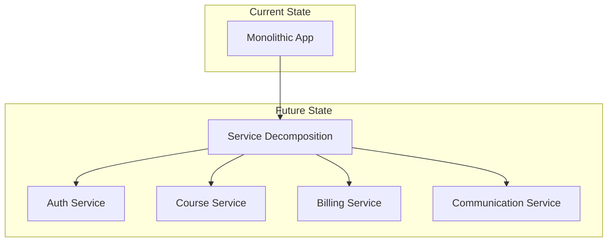

## 📈 Performance Optimization

### Caching Strategy

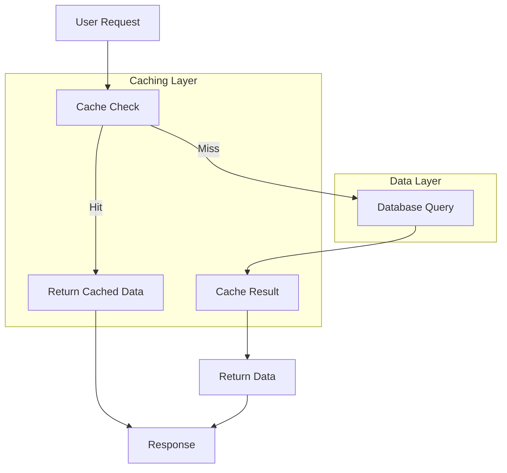

## 🧪 Testing Architecture

### Test Pyramid Implementation

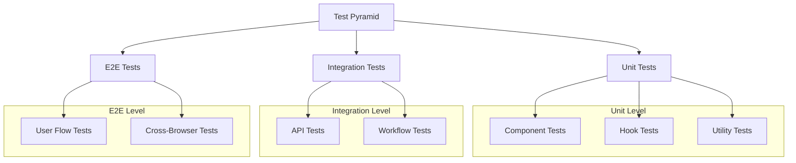

## 📚 Technology Stack Summary

### Frontend Stack
- **Framework**: React 18 with TypeScript
- **Build Tool**: Vite
- **Routing**: React Router v6
- **State Management**: React Context + Custom Hooks
- **UI Components**: shadcn/ui + Radix UI
- **Styling**: Tailwind CSS
- **Data Fetching**: React Query (TanStack Query)
- **Form Handling**: React Hook Form + Zod
- **Charts**: Recharts
- **Icons**: Lucide React

### Backend Stack
- **Platform**: Supabase (Backend as a Service)
- **Database**: PostgreSQL (via Supabase)
- **Authentication**: Supabase Auth
- **API**: Supabase REST + GraphQL
- **Realtime**: Supabase Realtime
- **Storage**: Supabase Storage
- **Functions**: Supabase Edge Functions

### Automation & Integration
- **Workflow Engine**: n8n
- **Email Services**: SendGrid, Amazon SES
- **SMS Services**: Twilio, Vonage
- **Cloud Storage**: Multiple providers
- **Payment Processing**: Stripe, PayPal

### Development & Deployment
- **Version Control**: Git
- **CI/CD**: GitHub Actions
- **Hosting**: Vercel (Frontend), Supabase (Backend)
- **Monitoring**: Supabase Analytics
- **Testing**: Jest, React Testing Library
- **Code Quality**: ESLint, Prettier

---

*This architecture document provides a comprehensive overview of the CampusSync system design, from high-level components to detailed implementation patterns. It serves as a reference for understanding how different parts of the system interact and can guide future development and scaling efforts.*